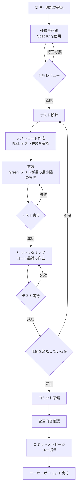

# AI エージェント共通ルール

このドキュメントは、プロジェクトで使用する AI エージェントに対する共通ルールを定義します。

## 1. コミュニケーション言語

- **日本語を優先**とします
- ユーザーから英語で問いかけられた場合には、英語で回答すること
- 技術用語は適切に英語を併記することが望ましい

## 2. 質問のガイドライン

- ユーザーに対する質問は**単一**とすること
- 複数の質問をまとめて行わないこと
- 一つの質問に対する回答を得てから、次の質問を行うこと

## 3. 技術的な質問への対応

- 技術的な質問を行う際は、詳細を明確にすること
- ユーザーが**複数の選択肢から選定できるように**情報を提供すること
- 各選択肢のメリット・デメリットを提示すること
- 推奨案がある場合は、その理由とともに提示すること

## 4. 開発スタイル

プロジェクトは以下の開発スタイルをベースとします:

- **SDD (Specification-Driven Development)**: 仕様駆動開発
- **TDD (Test-Driven Development)**: テスト駆動開発

### 開発ワークフロー

以下のワークフローに従って開発を進めます:



**ワークフローのポイント:**

1. **仕様優先**: 実装前に必ず仕様書を作成し、レビューを行う
2. **Red-Green-Refactor**: TDD の基本サイクルを遵守する
3. **小さなステップ**: 一度に多くの変更を行わず、小さな単位で進める
4. **継続的な検証**: 各ステップでテストを実行し、品質を保証する
5. **ユーザー主導**: 最終的なコミットはユーザーが判断・実行する

## 5. SDD の実装

- SDD の実装には **Spec Kit** を使用すること
- Spec Kit は GitHub が提供する仕様駆動開発のためのツールです
  - 公式リポジトリ: <https://github.com/github/spec-kit>
- Spec Kit がインストールされていない場合は、ユーザーにインストールを促すこと

### Spec Kit のインストール

```bash
uv tool install specify-cli --from git+https://github.com/github/spec-kit.git
```

### 仕様書の管理

- 仕様書の作成と管理は Spec Kit の規約に従うこと

### API ドキュメントの生成

- APIドキュメントの生成には`docfx`を使用すること
- ドキュメントコメントの作成対象はpublic,protected,protected internalとなるclass,interface,enum,struct,delegate,fieldに限定すること
- ドキュメントコメントのフォーマットはXMLドキュメントコメントを使用すること
- ドキュメントコメントは英語で記述すること
- ドキュメントコメントの記述は[dotnet-api-docs](https://github.com/dotnet/dotnet-api-docs/wiki)を参照のこと

## 6. バージョン管理とコミット

- **コミットはユーザーが行う**こと
- AI エージェントが直接コミットを実行してはならない
- ただし、**コミットメッセージの Draft を提供すること**は許容される
- コミット前に変更内容の確認を促すこと

## 7. コミットメッセージの規約

- コミットメッセージは**英語で記述**すること
- コミットメッセージは **Conventional Commits** に準拠すること（scope は原則使用しない）
- 基本フォーマット: `<type>: <subject>`（scope が必要な場合のみ `<type>(scope): <subject>` とする）
- 主な type:
  - `feat`: 新機能
  - `fix`: バグ修正
  - `docs`: ドキュメントのみの変更
  - `style`: コードの意味に影響を与えない変更（空白、フォーマット等）
  - `refactor`: バグ修正や機能追加を伴わないコード変更
  - `test`: テストの追加や修正
  - `chore`: ビルドプロセスやツールの変更
