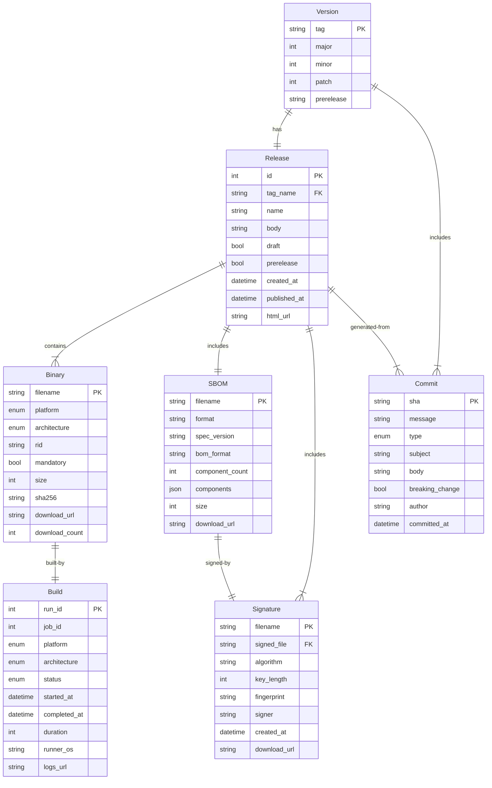
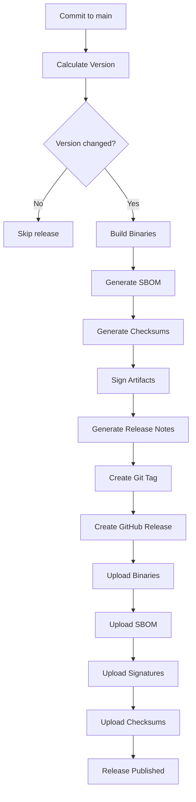
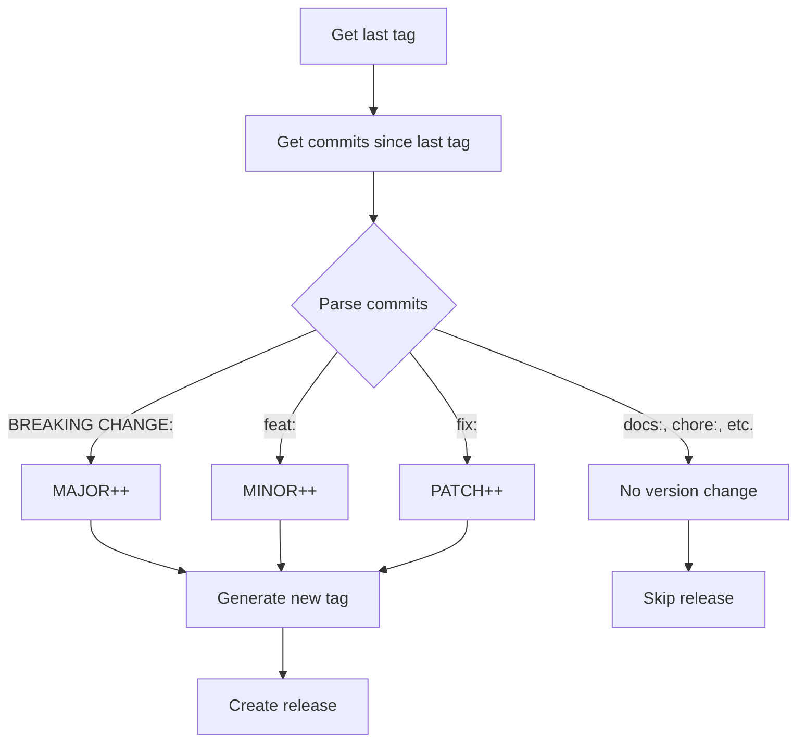
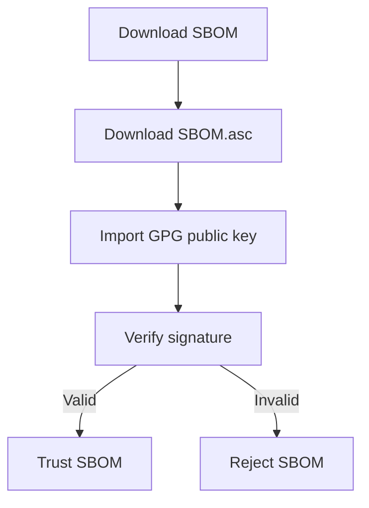

# Data Model: Automated Binary Release Pipeline

**Feature**: `003-automated-release-pipeline`  
**Date**: 2026-01-05  
**Related**: [spec.md](spec.md), [plan.md](plan.md)

このドキュメントは、自動化されたバイナリリリースパイプラインのデータモデルを定義します。

---

## 概要

リリースパイプラインは、以下の主要エンティティで構成されます:

1. **Version** - リリースバージョン情報
2. **Release** - GitHub Release エンティティ
3. **Binary** - プラットフォーム固有のバイナリファイル
4. **SBOM** - Software Bill of Materials
5. **Signature** - デジタル署名情報
6. **Commit** - Gitコミット履歴
7. **Build** - ビルドジョブの実行情報

---

## エンティティ定義

### 1. Version

バージョン情報を表現するエンティティ。

**属性**:

| 属性             | 型      | 必須 | 説明                         | 例                  |
| ---------------- | ------- | ---- | ---------------------------- | ------------------- |
| `tag`            | String  | ✅   | Gitタグ (プレフィックス付き) | `v1.2.3`            |
| `major`          | Integer | ✅   | MAJORバージョン              | `1`                 |
| `minor`          | Integer | ✅   | MINORバージョン              | `2`                 |
| `patch`          | Integer | ✅   | PATCHバージョン              | `3`                 |
| `prerelease`     | String  | ❌   | プレリリースラベル           | `alpha.1`, `beta.2` |
| `build_metadata` | String  | ❌   | ビルドメタデータ             | `20260105`          |

**バージョン計算ロジック**:

```text
Input: Commit history since last tag
Process:
  1. Parse commits for Conventional Commits types
  2. Detect BREAKING CHANGE → MAJOR++, MINOR=0, PATCH=0
  3. Detect feat: → MINOR++, PATCH=0
  4. Detect fix: → PATCH++
  5. Otherwise → No version change
Output: New version tag (e.g., v1.3.0)
```

**関連**:

- `Release.version` (1:1) - リリースに関連付けられたバージョン
- `Commit.version` (N:1) - バージョンに含まれるコミット一覧

---

### 2. Release

GitHub Releaseエンティティ。

**属性**:

| 属性           | 型       | 必須 | 説明                      | 例                                                 |
| -------------- | -------- | ---- | ------------------------- | -------------------------------------------------- |
| `id`           | Integer  | ✅   | GitHub Release ID         | `12345678`                                         |
| `tag_name`     | String   | ✅   | リリースタグ              | `v1.2.3`                                           |
| `name`         | String   | ✅   | リリース名                | `v1.2.3`                                           |
| `body`         | String   | ✅   | リリースノート (Markdown) | `## Features\n- Add feature A`                     |
| `draft`        | Boolean  | ✅   | ドラフト状態              | `false`                                            |
| `prerelease`   | Boolean  | ✅   | プレリリース              | `false`                                            |
| `created_at`   | DateTime | ✅   | 作成日時                  | `2026-01-05T12:00:00Z`                             |
| `published_at` | DateTime | ✅   | 公開日時                  | `2026-01-05T12:30:00Z`                             |
| `html_url`     | String   | ✅   | GitHub Release URL        | `https://github.com/kuju63/wt/releases/tag/v1.2.3` |

**関連**:

- `Version` (1:1) - バージョン情報
- `Binary[]` (1:N) - リリースに含まれるバイナリファイル
- `SBOM` (1:1) - リリースのSBOM
- `Signature[]` (1:N) - リリースのデジタル署名

---

### 3. Binary

プラットフォーム固有のバイナリファイル。

**属性**:

| 属性             | 型      | 必須 | 説明                   | 例                                                    |
| ---------------- | ------- | ---- | ---------------------- | ----------------------------------------------------- |
| `filename`       | String  | ✅   | ファイル名             | `wt-v1.2.3-linux-x64`                                 |
| `platform`       | Enum    | ✅   | プラットフォーム       | `windows`, `linux`, `macos`                           |
| `architecture`   | Enum    | ✅   | アーキテクチャ         | `x64`, `arm64`, `arm`                                 |
| `rid`            | String  | ✅   | Runtime Identifier     | `linux-x64`, `win-x64`, `osx-arm64`                   |
| `mandatory`      | Boolean | ✅   | 必須プラットフォーム   | `true` (失敗でリリースブロック), `false` (オプション) |
| `size`           | Integer | ✅   | ファイルサイズ (bytes) | `15728640` (15 MB)                                    |
| `sha256`         | String  | ✅   | SHA256ハッシュ値       | `a3c5d...` (64文字)                                   |
| `download_url`   | String  | ✅   | ダウンロードURL        | `https://github.com/.../wt-v1.2.3-linux-x64`          |
| `download_count` | Integer | ✅   | ダウンロード数         | `1234`                                                |

**プラットフォーム列挙型**:

```yaml
Platform:
  - windows  # MANDATORY
  - linux    # MANDATORY (x64), OPTIONAL (arm)
  - macos    # MANDATORY (arm64)
```

**アーキテクチャ列挙型**:

```yaml
Architecture:
  - x64    # 64-bit x86
  - arm64  # 64-bit ARM (Apple Silicon)
  - arm    # 32-bit ARM (Raspberry Pi等)
```

**関連**:

- `Release` (N:1) - 所属するリリース
- `Build` (1:1) - ビルドジョブ情報

---

### 4. SBOM (Software Bill of Materials)

CycloneDX形式のSBOM。

**属性**:

| 属性              | 型          | 必須 | 説明                   | 例                                           |
| ----------------- | ----------- | ---- | ---------------------- | -------------------------------------------- |
| `filename`        | String      | ✅   | ファイル名             | `wt-v1.2.3-sbom.json`                        |
| `format`          | String      | ✅   | SBOM形式               | `CycloneDX`                                  |
| `spec_version`    | String      | ✅   | 仕様バージョン         | `1.4`, `1.5`                                 |
| `bom_format`      | String      | ✅   | BOMフォーマット        | `json`, `xml`                                |
| `component_count` | Integer     | ✅   | コンポーネント数       | `42`                                         |
| `components`      | Component[] | ✅   | 依存関係リスト         | (下記参照)                                   |
| `size`            | Integer     | ✅   | ファイルサイズ (bytes) | `524288` (512 KB)                            |
| `download_url`    | String      | ✅   | ダウンロードURL        | `https://github.com/.../wt-v1.2.3-sbom.json` |

**Component (コンポーネント)**:

| 属性       | 型       | 説明         | 例                                    |
| ---------- | -------- | ------------ | ------------------------------------- |
| `name`     | String   | パッケージ名 | `System.CommandLine`                  |
| `version`  | String   | バージョン   | `2.0.0`                               |
| `type`     | String   | タイプ       | `library`, `framework`, `application` |
| `licenses` | String[] | ライセンス   | `["MIT"]`                             |
| `purl`     | String   | Package URL  | `pkg:nuget/System.CommandLine@2.0.0`  |

**関連**:

- `Release` (N:1) - 所属するリリース
- `Signature` (1:1) - SBOM署名

---

### 5. Signature

GPGデジタル署名。

**属性**:

| 属性           | 型       | 必須 | 説明                    | 例                                               |
| -------------- | -------- | ---- | ----------------------- | ------------------------------------------------ |
| `filename`     | String   | ✅   | 署名ファイル名          | `wt-v1.2.3-sbom.json.asc`                        |
| `signed_file`  | String   | ✅   | 署名対象ファイル        | `wt-v1.2.3-sbom.json`                            |
| `algorithm`    | String   | ✅   | 署名アルゴリズム        | `RSA`, `DSA`                                     |
| `key_length`   | Integer  | ✅   | 鍵長 (bits)             | `4096`                                           |
| `fingerprint`  | String   | ✅   | GPG鍵フィンガープリント | `ABCD1234...` (40文字)                           |
| `signer`       | String   | ✅   | 署名者                  | `Release Bot <release@example.com>`              |
| `created_at`   | DateTime | ✅   | 署名作成日時            | `2026-01-05T12:25:00Z`                           |
| `download_url` | String   | ✅   | ダウンロードURL         | `https://github.com/.../wt-v1.2.3-sbom.json.asc` |

**署名対象ファイル**:

- `wt-v<version>-sbom.json` → `wt-v<version>-sbom.json.asc`
- `SHA256SUMS` → `SHA256SUMS.asc`

**関連**:

- `SBOM` (1:1) - 署名されたSBOM
- `Release` (N:1) - 所属するリリース

---

### 6. Commit

Gitコミット履歴。

**属性**:

| 属性              | 型       | 必須 | 説明                       | 例                             |
| ----------------- | -------- | ---- | -------------------------- | ------------------------------ |
| `sha`             | String   | ✅   | コミットSHA                | `a3c5d1f...` (40文字)          |
| `message`         | String   | ✅   | コミットメッセージ         | `feat: add feature A`          |
| `type`            | Enum     | ✅   | Conventional Commit タイプ | `feat`, `fix`, `docs`, `chore` |
| `subject`         | String   | ✅   | コミット件名               | `add feature A`                |
| `body`            | String   | ❌   | コミット本文               | `Detailed description...`      |
| `breaking_change` | Boolean  | ✅   | 破壊的変更フラグ           | `true`, `false`                |
| `author`          | String   | ✅   | 作成者                     | `John Doe <john@example.com>`  |
| `committed_at`    | DateTime | ✅   | コミット日時               | `2026-01-04T10:00:00Z`         |

**Conventional Commit タイプ列挙型**:

```yaml
CommitType:
  - feat         # 新機能 (MINOR bump)
  - fix          # バグ修正 (PATCH bump)
  - docs         # ドキュメント (バージョン変更なし)
  - style        # コードスタイル (バージョン変更なし)
  - refactor     # リファクタリング (バージョン変更なし)
  - test         # テスト (バージョン変更なし)
  - chore        # ビルド/ツール (バージョン変更なし)
  - BREAKING     # 破壊的変更 (MAJOR bump)
```

**関連**:

- `Version` (N:1) - 所属するバージョン
- `Release` (N:1) - リリースノートに含まれるコミット

---

### 7. Build

GitHub Actionsビルドジョブ情報。

**属性**:

| 属性           | 型       | 必須 | 説明                           | 例                                                   |
| -------------- | -------- | ---- | ------------------------------ | ---------------------------------------------------- |
| `run_id`       | Integer  | ✅   | GitHub Actions Run ID          | `12345678`                                           |
| `job_id`       | Integer  | ✅   | Job ID                         | `87654321`                                           |
| `platform`     | Enum     | ✅   | ビルドプラットフォーム         | `windows`, `linux`, `macos`                          |
| `architecture` | Enum     | ✅   | アーキテクチャ                 | `x64`, `arm64`, `arm`                                |
| `status`       | Enum     | ✅   | ビルドステータス               | `success`, `failure`, `cancelled`                    |
| `started_at`   | DateTime | ✅   | 開始日時                       | `2026-01-05T12:00:00Z`                               |
| `completed_at` | DateTime | ✅   | 完了日時                       | `2026-01-05T12:10:00Z`                               |
| `duration`     | Integer  | ✅   | 実行時間 (秒)                  | `600` (10分)                                         |
| `runner_os`    | String   | ✅   | Runnerオペレーティングシステム | `ubuntu-latest`, `windows-latest`, `macos-latest`    |
| `logs_url`     | String   | ✅   | ログURL                        | `https://github.com/kuju63/wt/actions/runs/12345678` |

**ビルドステータス列挙型**:

```yaml
BuildStatus:
  - queued      # ビルド待機中
  - in_progress # ビルド実行中
  - success     # ビルド成功
  - failure     # ビルド失敗
  - cancelled   # ビルドキャンセル
```

**関連**:

- `Binary` (1:1) - 生成されたバイナリ
- `Release` (N:1) - 所属するリリース

---

## エンティティ関係図 (ER図)



---

## データフロー

### リリース作成フロー



### バージョン計算フロー



---

## ファイル命名規則

### バイナリファイル

```text
wt-<version>-<platform>-<arch>[.<ext>]

Examples:
- wt-v1.2.3-windows-x64.exe
- wt-v1.2.3-linux-x64
- wt-v1.2.3-linux-arm
- wt-v1.2.3-macos-arm64
```

### SBOMファイル

```text
wt-<version>-sbom.json

Example:
- wt-v1.2.3-sbom.json
```

### 署名ファイル

```text
<original-filename>.asc

Examples:
- wt-v1.2.3-sbom.json.asc
- SHA256SUMS.asc
```

### チェックサムファイル

```text
SHA256SUMS

Format (inside file):
<hash>  <filename>

Example:
a3c5d1f2b4e6...  wt-v1.2.3-linux-x64
b5d7e2f3c5g8...  wt-v1.2.3-windows-x64.exe
```

---

## API契約

### GitHub Release API

**Endpoint**: `POST /repos/{owner}/{repo}/releases`

**Request**:

```json
{
  "tag_name": "v1.2.3",
  "name": "v1.2.3",
  "body": "## Features\n- Add feature A\n\n## Bug Fixes\n- Fix bug B",
  "draft": false,
  "prerelease": false
}
```

**Response**:

```json
{
  "id": 12345678,
  "tag_name": "v1.2.3",
  "name": "v1.2.3",
  "body": "...",
  "draft": false,
  "prerelease": false,
  "created_at": "2026-01-05T12:00:00Z",
  "published_at": "2026-01-05T12:30:00Z",
  "html_url": "https://github.com/kuju63/wt/releases/tag/v1.2.3",
  "assets": [...]
}
```

---

## ストレージ

### GitHub Releases (Primary Storage)

- **バイナリファイル**: 最大2GB/ファイル, 10GB/リリース
- **保存期間**: 無期限 (リリース削除まで)
- **アクセス**: Public (認証不要でダウンロード可能)

### Git Repository (Metadata Storage)

- **Gitタグ**: バージョン情報 (`v1.2.3`)
- **コミット履歴**: リリースノート生成元
- **ドキュメント**: GPG公開鍵 (`docs/GPG_PUBLIC_KEY.asc`)

### GitHub Actions Artifacts (Temporary Storage)

- **ビルド成果物**: 一時保存 (7日間保持)
- **カバレッジレポート**: 一時保存 (7日間保持)
- **ログファイル**: 一時保存 (90日間保持)

---

## セキュリティ考慮事項

### シークレット管理

| シークレット           | 用途                | 保存場所                  |
| ---------------------- | ------------------- | ------------------------- |
| `GITHUB_TOKEN`         | GitHub API認証      | GitHub Actions (自動生成) |
| `GPG_PRIVATE_KEY`      | デジタル署名        | GitHub Secrets            |
| `GPG_PASSPHRASE`       | GPG鍵のパスフレーズ | GitHub Secrets            |
| `CODACY_PROJECT_TOKEN` | カバレッジ報告      | GitHub Secrets            |

### 署名検証フロー



---

## 参考資料

- [Semantic Versioning 2.0.0](https://semver.org/)
- [Conventional Commits 1.0.0](https://www.conventionalcommits.org/)
- [CycloneDX Specification](https://cyclonedx.org/specification/overview/)
- [GitHub Releases API](https://docs.github.com/en/rest/releases)
- [GitHub Actions Workflow Syntax](https://docs.github.com/en/actions/using-workflows/workflow-syntax-for-github-actions)
