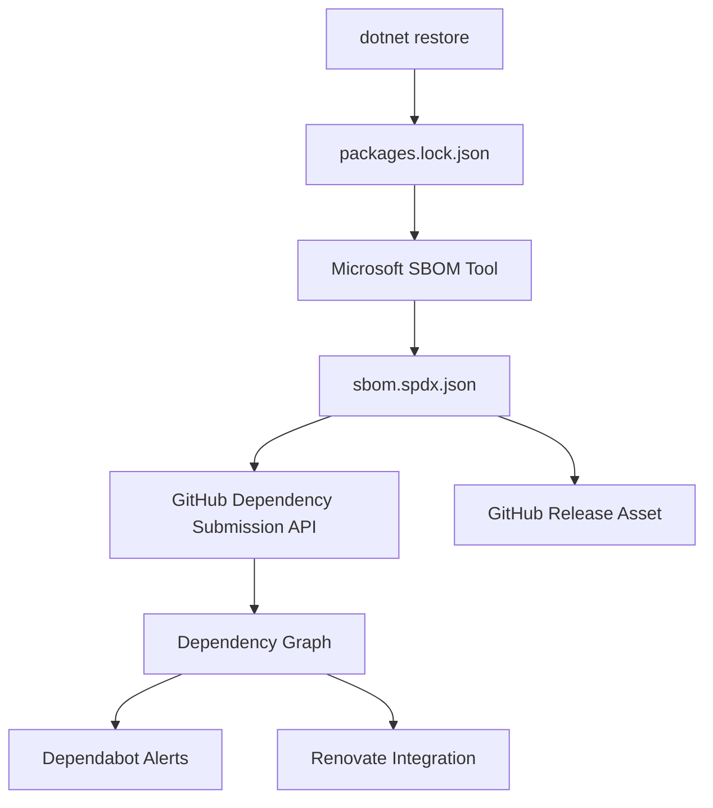
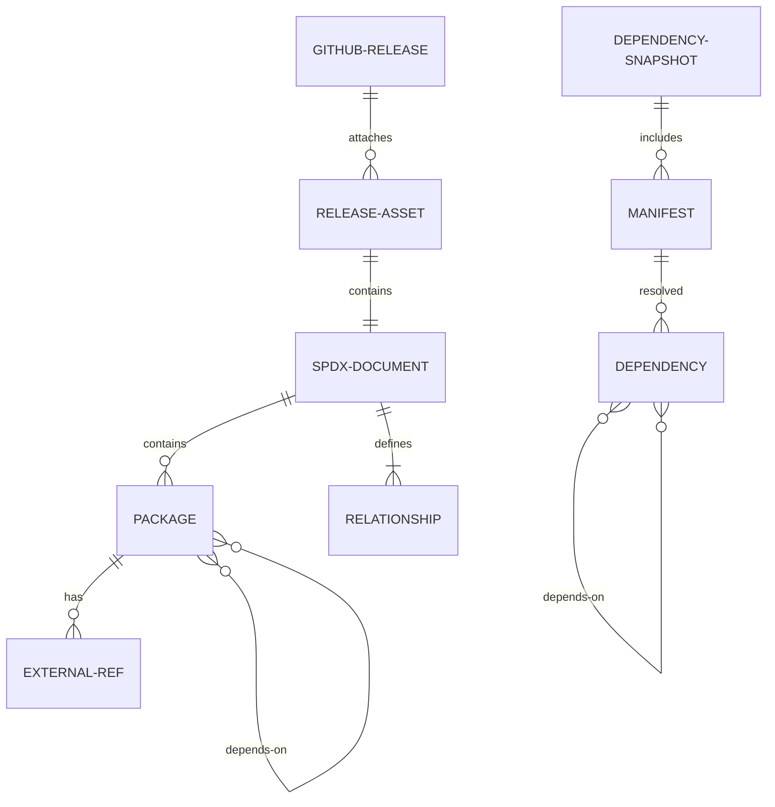
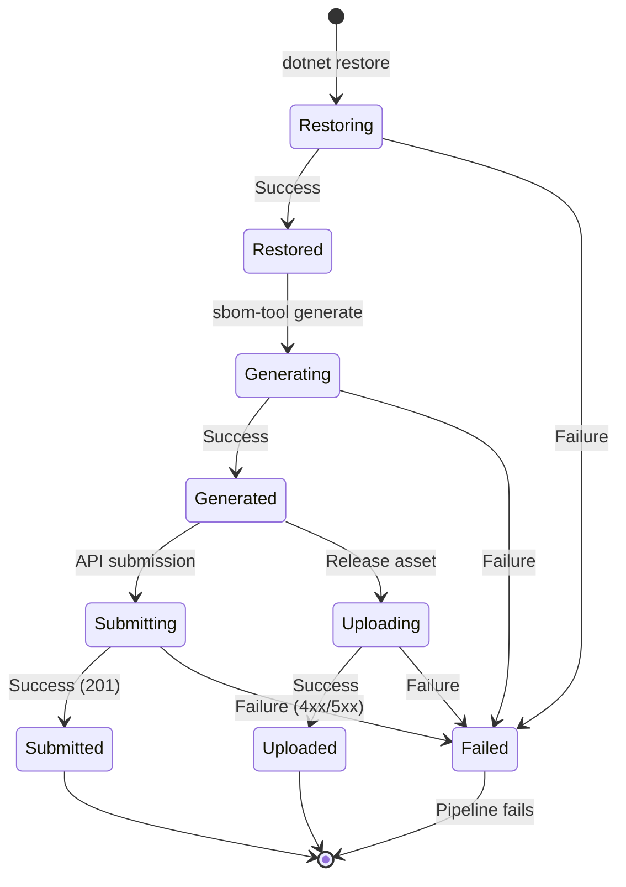

# Phase 1: Data Model

SBOM生成機能はCI/CDパイプライン（ワークフロー）の変更のみで実現するため、アプリケーションコード内で使用する新しいデータモデルは基本的に不要です。ここでは、SBOM生成プロセスで扱う概念的なデータ構造を文書化します。

---

## 1. SBOM Document (SPDX 2.3形式)

### 概要

Microsoft SBOM Toolが生成するSPDX 2.3形式のJSON文書。

### 構造

```typescript
interface SpdxDocument {
  spdxVersion: "SPDX-2.3";
  dataLicense: "CC0-1.0";
  SPDXID: string;  // "SPDXRef-DOCUMENT"
  name: string;    // プロジェクト名
  documentNamespace: string;  // 一意のURI
  creationInfo: CreationInfo;
  packages: Package[];
  relationships: Relationship[];
}

interface CreationInfo {
  created: string;  // ISO 8601形式
  creators: string[];  // "Tool: Microsoft.Sbom.Tool-x.x.x"
  licenseListVersion?: string;
}

interface Package {
  SPDXID: string;  // "SPDXRef-Package-{hash}"
  name: string;
  versionInfo: string;
  downloadLocation: string;  // NuGetパッケージURL
  filesAnalyzed: boolean;
  licenseConcluded: string;  // SPDX License Identifier or "NOASSERTION"
  licenseDeclared: string;
  copyrightText: string;
  externalRefs?: ExternalRef[];
}

interface ExternalRef {
  referenceCategory: "PACKAGE-MANAGER";
  referenceType: "purl";
  referenceLocator: string;  // Package URL形式
}

interface Relationship {
  spdxElementId: string;
  relationshipType: "DEPENDS_ON" | "DESCRIBES" | "CONTAINS";
  relatedSpdxElement: string;
}
```

### 使用例

```json
{
  "spdxVersion": "SPDX-2.3",
  "dataLicense": "CC0-1.0",
  "SPDXID": "SPDXRef-DOCUMENT",
  "name": "wt CLI Tool",
  "documentNamespace": "https://github.com/kuju63/wt/sbom/v1.0.0-20260106",
  "creationInfo": {
    "created": "2026-01-06T12:00:00Z",
    "creators": ["Tool: Microsoft.Sbom.Tool-2.2.0"]
  },
  "packages": [
    {
      "SPDXID": "SPDXRef-Package-1234",
      "name": "System.CommandLine",
      "versionInfo": "2.0.1",
      "downloadLocation": "https://www.nuget.org/packages/System.CommandLine/2.0.1",
      "filesAnalyzed": false,
      "licenseConcluded": "MIT",
      "licenseDeclared": "MIT",
      "copyrightText": "Copyright Microsoft Corporation",
      "externalRefs": [
        {
          "referenceCategory": "PACKAGE-MANAGER",
          "referenceType": "purl",
          "referenceLocator": "pkg:nuget/System.CommandLine@2.0.1"
        }
      ]
    }
  ],
  "relationships": [
    {
      "spdxElementId": "SPDXRef-DOCUMENT",
      "relationshipType": "DESCRIBES",
      "relatedSpdxElement": "SPDXRef-Package-1234"
    }
  ]
}
```

---

## 2. Dependency Snapshot (GitHub API形式)

### 概要

GitHub Dependency Submission APIに送信する依存関係スナップショット。

### 構造

```typescript
interface DependencySnapshot {
  version: 0;  // APIバージョン
  sha: string;  // コミットSHA
  ref: string;  // ブランチ参照（例: "refs/heads/main"）
  job: JobInfo;
  detector: DetectorInfo;
  scanned: string;  // ISO 8601形式
  manifests: Record<string, Manifest>;
}

interface JobInfo {
  correlator: string;  // ワークフロー識別子
  id: string;  // ジョブID
}

interface DetectorInfo {
  name: string;  // "Microsoft SBOM Tool"
  version: string;
  url: string;
}

interface Manifest {
  name: string;  // マニフェストファイル名
  file?: {
    source_location: string;
  };
  resolved: Record<string, Dependency>;
}

interface Dependency {
  package_url: string;  // Package URL (purl)
  relationship: "direct" | "indirect";
  scope?: "runtime" | "development";
  dependencies?: string[];  // 依存パッケージのpurlリスト
}
```

### 使用例

```json
{
  "version": 0,
  "sha": "abc123...",
  "ref": "refs/heads/main",
  "job": {
    "correlator": "release-publish",
    "id": "12345678"
  },
  "detector": {
    "name": "Microsoft SBOM Tool",
    "version": "2.2.0",
    "url": "https://github.com/microsoft/sbom-tool"
  },
  "scanned": "2026-01-06T12:00:00Z",
  "manifests": {
    "wt.cli.csproj": {
      "name": "wt.cli",
      "file": {
        "source_location": "wt.cli/wt.cli.csproj"
      },
      "resolved": {
        "System.CommandLine@2.0.1": {
          "package_url": "pkg:nuget/System.CommandLine@2.0.1",
          "relationship": "direct",
          "scope": "runtime",
          "dependencies": [
            "pkg:nuget/System.Memory@4.5.5"
          ]
        },
        "System.Memory@4.5.5": {
          "package_url": "pkg:nuget/System.Memory@4.5.5",
          "relationship": "indirect",
          "scope": "runtime"
        }
      }
    }
  }
}
```

---

## 3. Workflow Configuration (GitHub Actions)

### 概要

ワークフロー定義で使用する設定パラメータ。

### 構造

```typescript
interface WorkflowConfig {
  sbom: SbomConfig;
  github: GitHubConfig;
  performance: PerformanceConfig;
}

interface SbomConfig {
  outputDir: string;  // SBOM出力ディレクトリ（例: "_manifest"）
  fileName: string;   // SBOMファイル名（例: "sbom.spdx.json"）
  format: "spdx";     // フォーマット
  packageName: string;  // パッケージ名
  packageVersion: string;  // バージョン
  namespace: string;  // ドキュメント名前空間URI
}

interface GitHubConfig {
  repository: string;  // リポジトリ名（owner/repo）
  token: string;       // GITHUB_TOKEN
  releaseTag: string;  // リリースタグ
  permissions: {
    contents: "write";
    idToken: "write";
  };
}

interface PerformanceConfig {
  restoreTimeout: number;  // リストアタイムアウト（分）
  sbomTimeout: number;     // SBOM生成タイムアウト（分）
  cacheEnabled: boolean;   // キャッシュ有効化
  cachePath: string;       // キャッシュパス
  cacheKey: string;        // キャッシュキー
}
```

### 使用例（GitHub Actionsワークフロー）

```yaml
env:
  SBOM_OUTPUT_DIR: _manifest
  SBOM_FILE_NAME: sbom.spdx.json
  PACKAGE_NAME: ${{ github.repository }}
  PACKAGE_VERSION: ${{ steps.version.outputs.version }}
  NAMESPACE: https://github.com/${{ github.repository }}/sbom/${{ steps.version.outputs.version }}
  
jobs:
  generate-sbom:
    permissions:
      contents: write
      id-token: write
    timeout-minutes: 15
```

---

## 4. Package URL (purl) 形式

### 概要

依存関係パッケージを一意に識別するための標準形式。

### 構造

```text
pkg:<type>/<namespace>/<name>@<version>?<qualifiers>#<subpath>

# NuGetの例
pkg:nuget/System.CommandLine@2.0.1

# プラットフォーム固有の例
pkg:nuget/System.CommandLine@2.0.1?targetframework=net10.0
```

### TypeScript型定義

```typescript
interface PackageUrl {
  type: "nuget" | "npm" | "pypi" | "maven" | ...;
  namespace?: string;
  name: string;
  version: string;
  qualifiers?: Record<string, string>;
  subpath?: string;
}

function formatPurl(purl: PackageUrl): string {
  let result = `pkg:${purl.type}`;
  if (purl.namespace) result += `/${purl.namespace}`;
  result += `/${purl.name}`;
  if (purl.version) result += `@${purl.version}`;
  
  if (purl.qualifiers) {
    const queries = Object.entries(purl.qualifiers)
      .map(([k, v]) => `${k}=${v}`)
      .join('&');
    result += `?${queries}`;
  }
  
  if (purl.subpath) result += `#${purl.subpath}`;
  return result;
}
```

---

## 5. Release Asset Metadata

### 概要

GitHubリリースに添付するSBOMファイルのメタデータ。

### 構造

```typescript
interface ReleaseAsset {
  name: string;  // "wt-v1.0.0-sbom.spdx.json"
  label: string;  // "SBOM (SPDX 2.3)"
  contentType: "application/json";
  size: number;  // バイト数
  state: "uploaded";
  browserDownloadUrl: string;  // ダウンロードURL
}
```

### 使用例

```json
{
  "name": "wt-v1.0.0-sbom.spdx.json",
  "label": "SBOM (SPDX 2.3)",
  "contentType": "application/json",
  "size": 45678,
  "state": "uploaded",
  "browserDownloadUrl": "https://github.com/kuju63/wt/releases/download/v1.0.0/wt-v1.0.0-sbom.spdx.json"
}
```

---

## データフロー図



---

## エンティティ関係図



---

## 状態遷移図



---

## バリデーションルール

### SPDX Document

- `spdxVersion` は "SPDX-2.3" 固定
- `dataLicense` は "CC0-1.0" 固定
- `documentNamespace` は一意のURI（リポジトリ + バージョン + タイムスタンプ）
- `packages` は1個以上必要

### Package

- `name` と `versionInfo` は必須
- `licenseConcluded` は SPDX License Identifier または "NOASSERTION"
- `downloadLocation` は有効なURL または "NOASSERTION"

### Dependency Snapshot

- `version` は 0 固定
- `sha` は有効なGitコミットSHA
- `package_url` はPackage URL仕様に準拠

---

## まとめ

この機能はアプリケーションコードの変更を伴わないため、新しいデータモデルの実装は不要です。上記のデータ構造はすべて：

1. **Microsoft SBOM Tool** が自動生成（SPDX Document）
2. **GitHub Actions** が構築（Dependency Snapshot、Workflow Config）
3. **GitHub API** が定義（Release Asset）

したがって、Phase 2のタスク分解では、これらの外部ツール・APIの正しい使用に焦点を当てます。
