# Tasks: Complete SBOM Generation in Release Pipeline

**Branch**: `004-complete-sbom-generation`  
**Input**: Design documents from `/specs/004-complete-sbom-generation/`  
**Prerequisites**: plan.md ✅, spec.md ✅, research.md ✅, data-model.md ✅, contracts/ ✅

## Format: `[ID] [P?] [Story] Description`

- **[P]**: Can run in parallel (different files, no dependencies)
- **[Story]**: Which user story this task belongs to (e.g., US1, US2, US3, US4)
- Include exact file paths in descriptions

---

## Phase 1: Setup (Project Initialization)

**Purpose**: Initialize project structure and prerequisite scripts

- [X] T001 Create ADR document for SBOM generation approach in docs/adr/004-sbom-generation.md
- [X] T002 [P] Create SBOM usage guide in docs/guides/sbom-usage.md (copy from specs/004-complete-sbom-generation/quickstart.md)
- [X] T003 [P] Add SBOM section to README.md explaining supply chain transparency

---

## Phase 2: Foundational (Blocking Prerequisites)

**Purpose**: Workflow infrastructure that MUST be complete before user story implementation

**⚠️ CRITICAL**: No user story work can begin until this phase is complete

- [X] T004 Setup NuGet package caching in .github/workflows/release.yml (FR-015)
- [X] T005 Configure workflow permissions (contents: write, id-token: write) in .github/workflows/release.yml (FR-011)
- [X] T006 Add workflow timeout settings (15 minutes) in .github/workflows/release.yml (FR-014)

**Checkpoint**: Foundation ready - user story implementation can now begin

---

## Phase 3: User Story 1 - 完全な依存関係の開示 (Priority: P1) 🎯 MVP

**Goal**: Generate complete SBOM with all direct and transitive dependencies

**Independent Test**: Compare generated SBOM with project files to verify 100% dependency coverage

### Implementation for User Story 1

- [X] T007 [US1] Add dependency restore step before SBOM generation in .github/workflows/release.yml (FR-001)
- [X] T008 [US1] Configure dotnet restore with --locked-mode flag in .github/workflows/release.yml (FR-001, FR-002)
- [X] T009 [US1] Add multi-platform restore for all target platforms (win-x64, linux-x64, linux-arm, osx-arm64) in .github/workflows/release.yml (FR-016)
- [X] T010 [US1] Install Microsoft SBOM Tool in workflow in .github/workflows/release.yml (FR-006)
- [X] T011 [US1] Configure SBOM generation with correct parameters (package name, version, namespace) in .github/workflows/release.yml (FR-002, FR-003, FR-008, FR-009)
- [X] T012 [US1] Add error handling for restore failures in .github/workflows/release.yml (FR-004)
- [X] T013 [US1] Add error handling for SBOM generation failures in .github/workflows/release.yml (FR-004)
- [X] T014 [US1] Add detailed logging for restore and SBOM generation steps in .github/workflows/release.yml (FR-007)

**Checkpoint**: User Story 1 complete - SBOM with all dependencies is generated

---

## Phase 4: User Story 2 - SBOMの検証 (Priority: P2)

**Goal**: Validate generated SBOM is complete and accurate before release

**Independent Test**: Run SPDX validator and verify all required packages are present

### Implementation for User Story 2

- [X] T015 [US2] Add SPDX format validation step using @spdx/spdx-validator in .github/workflows/release.yml (FR-006)
- [X] T016 [US2] Add required package verification step in .github/workflows/release.yml (FR-002)
- [X] T017 [US2] Verify System.CommandLine and System.IO.Abstractions are present in SBOM in .github/workflows/release.yml (FR-002)
- [X] T018 [US2] Add package count validation (minimum threshold check) in .github/workflows/release.yml (FR-003)
- [X] T019 [US2] Add validation failure reporting with detailed error messages in .github/workflows/release.yml (FR-007)
- [X] T020 [US2] Configure pipeline to fail on validation errors in .github/workflows/release.yml (FR-004)

**Checkpoint**: User Story 2 complete - SBOM validation ensures quality before release

---

## Phase 5: User Story 4 - GitHubへのSBOM統合 (Priority: P2)

**Goal**: Integrate SBOM with GitHub Dependency Graph and enable Dependabot/Renovate

**Independent Test**: Verify dependencies appear in GitHub Dependency Graph and Dependabot alerts are generated

### Implementation for User Story 4

- [X] T021 [US4] Add GitHub Dependency Submission API integration using actions/dependency-submission@v3 in .github/workflows/release.yml (FR-011, FR-018)
- [X] T022 [US4] Configure SBOM file path and snapshot format (spdx) in .github/workflows/release.yml (FR-011)
- [X] T023 [US4] Add error handling for API submission failures (must fail pipeline) in .github/workflows/release.yml (FR-013)
- [X] T024 [US4] Add SBOM file upload to GitHub Release assets in .github/workflows/release.yml (FR-005, FR-012)
- [X] T025 [US4] Configure SBOM filename format (wt-{version}-sbom.spdx.json) in .github/workflows/release.yml (FR-012)
- [X] T026 [US4] Add error handling for release asset upload failures in .github/workflows/release.yml (FR-004)
- [X] T027 [US4] Add logging for GitHub API interactions in .github/workflows/release.yml (FR-007)

**Checkpoint**: User Story 4 complete - SBOM is integrated with GitHub ecosystem

---

## Phase 6: User Story 3 - SBOM形式の準拠 (Priority: P3)

**Goal**: Ensure SBOM complies with SPDX 2.3+ (ISO/IEC 5962:2021) standards

**Independent Test**: Validate SBOM against official SPDX 2.3 schema

### Implementation for User Story 3

- [X] T028 [US3] Verify Microsoft SBOM Tool generates SPDX 2.3+ format in .github/workflows/release.yml (FR-006)
- [X] T029 [US3] Add SPDX version verification (must be SPDX-2.3) in .github/workflows/release.yml (FR-006)
- [X] T030 [US3] Add dataLicense verification (must be CC0-1.0) in .github/workflows/release.yml (FR-006)
- [X] T031 [US3] Add documentNamespace uniqueness verification in .github/workflows/release.yml (FR-006)
- [X] T032 [US3] Add NOASSERTION handling for missing license information in .github/workflows/release.yml (FR-010, FR-017)

**Checkpoint**: User Story 3 complete - SBOM format is standards-compliant

---

## Phase 7: PR Testing Workflow (Quality Assurance)

**Goal**: Enable early detection of SBOM generation issues before release

**Independent Test**: Create PR and verify SBOM test workflow runs successfully

### Implementation for PR Testing

- [X] T033 Create PR test workflow file .github/workflows/sbom-test.yml (FR-019)
- [X] T034 Configure PR trigger for workflow (on pull_request to main branch) in .github/workflows/sbom-test.yml (FR-019)
- [X] T035 Add path filters (wt.cli/**, packages.lock.json, workflow files) in .github/workflows/sbom-test.yml (FR-019)
- [X] T036 [P] Add dependency restore step with caching in .github/workflows/sbom-test.yml (FR-001, FR-015, FR-019)
- [X] T037 [P] Add SBOM generation step in .github/workflows/sbom-test.yml (FR-019)
- [X] T038 Add SPDX format validation in .github/workflows/sbom-test.yml (FR-020)
- [X] T039 Add required package verification (System.CommandLine, System.IO.Abstractions) in .github/workflows/sbom-test.yml (FR-020)
- [X] T040 Add package count validation in .github/workflows/sbom-test.yml (FR-020)
- [X] T041 Add performance benchmark (15-minute timeout) in .github/workflows/sbom-test.yml (FR-014, FR-020)
- [X] T042 Add dry-run comment for GitHub API (no actual submission) in .github/workflows/sbom-test.yml (FR-021)
- [X] T043 Add SBOM artifact upload for PR review in .github/workflows/sbom-test.yml (FR-019)

**Checkpoint**: PR testing complete - Issues caught before release

---

## Phase 8: Polish & Cross-Cutting Concerns

**Purpose**: Performance optimization, documentation, and monitoring

- [X] T044 [P] Add performance metrics logging (duration tracking) in .github/workflows/release.yml
- [X] T045 [P] Add cache hit/miss reporting for NuGet packages in .github/workflows/release.yml
- [X] T046 Update documentation with SBOM download instructions in README.md
- [X] T047 Add workflow badges for SBOM test status in README.md
- [X] T048 Create example SBOM file for documentation in docs/examples/sbom.spdx.json
- [X] T049 [P] Add workflow failure notifications (optional) in .github/workflows/release.yml
- [X] T050 Update CHANGELOG.md with SBOM feature description

---

## Dependencies & Execution Order

### User Story Completion Order

```mermaid
graph TD
    Setup[Phase 1: Setup] --> Foundation[Phase 2: Foundation]
    Foundation --> US1[Phase 3: US1 - 完全な依存関係の開示]
    US1 --> US2[Phase 4: US2 - SBOMの検証]
    US1 --> US4[Phase 5: US4 - GitHubへのSBOM統合]
    US2 --> US3[Phase 6: US3 - SBOM形式の準拠]
    US4 --> US3
    US1 --> PR[Phase 7: PR Testing]
    US2 --> PR
    US3 --> Polish[Phase 8: Polish]
    US4 --> Polish
    PR --> Polish
```

### Critical Path

1. **Setup (T001-T003)** → 2. **Foundation (T004-T006)** → 3. **US1 Core (T007-T014)** → 4. **US2 Validation (T015-T020)** → 5. **US4 Integration (T021-T027)** → 6. **US3 Compliance (T028-T032)** → 7. **PR Testing (T033-T043)** → 8. **Polish (T044-T050)**

### Parallel Execution Opportunities

**After Foundation (T004-T006):**

- T007-T009 (Restore steps) can run independently from documentation tasks
- T010-T011 (SBOM tool setup) can be prepared in parallel

**During US2 (Phase 4):**

- T015 (SPDX validation) and T017 (Package verification) can run in parallel

**During Polish (Phase 8):**

- T044-T045 (Performance metrics), T048 (Example SBOM), T049 (Notifications) are all independent

---

## Implementation Strategy

### MVP Scope (Minimum Viable Product)

**Target**: User Story 1 only

- Phase 1: Setup (T001-T003)
- Phase 2: Foundation (T004-T006)
- Phase 3: US1 (T007-T014)

**Why**: This delivers the core value - complete SBOM generation. Validation, GitHub integration, and testing can be added incrementally.

### Incremental Delivery Plan

1. **Sprint 1 (MVP)**: T001-T014 - Basic SBOM generation with all dependencies
2. **Sprint 2**: T015-T020 - Add SBOM validation
3. **Sprint 3**: T021-T027 - GitHub Dependency Graph integration
4. **Sprint 4**: T028-T032 - SPDX compliance verification
5. **Sprint 5**: T033-T043 - PR testing workflow
6. **Sprint 6**: T044-T050 - Polish and documentation

### Task Complexity

- **Simple (1-2 hours)**: T001-T003, T010, T025, T029-T032, T044-T050
- **Medium (3-5 hours)**: T004-T009, T011-T014, T015-T020, T028, T033-T043
- **Complex (6+ hours)**: T021-T024, T026-T027

**Total Estimated Effort**: ~35-45 hours

---

## Validation Checklist

Before marking this feature complete, verify:

- [ ] All direct dependencies appear in generated SBOM
- [ ] All transitive dependencies appear in generated SBOM
- [ ] Platform-specific dependencies for all targets (win-x64, linux-x64, linux-arm, osx-arm64) included
- [ ] SBOM validates against SPDX 2.3 schema
- [ ] SBOM includes version information for all packages
- [ ] SBOM includes license information (or NOASSERTION) for all packages
- [ ] GitHub Dependency Graph displays all dependencies
- [ ] Dependabot alerts are generated for vulnerable dependencies
- [ ] SBOM file is downloadable from GitHub Release assets
- [ ] PR workflow catches SBOM generation failures
- [ ] Pipeline fails if SBOM generation fails
- [ ] Pipeline fails if GitHub API submission fails
- [ ] Pipeline fails if SBOM validation fails
- [ ] Performance: 50 dependencies → <5 minutes
- [ ] Performance: 200 dependencies → <15 minutes
- [ ] NuGet cache reduces restore time by 80% on repeat builds
- [ ] Documentation explains how to download and use SBOM
- [ ] Renovate can read dependency information from GitHub Dependency Graph

---

## Notes

### Key Design Decisions

1. **No source code changes**: All changes are workflow-only
2. **Microsoft SBOM Tool**: Official tool for .NET projects, SPDX 2.3+ compliant
3. **Fail-fast**: Any SBOM-related failure stops the release (quality gate)
4. **PR testing**: Dry-run mode prevents polluting production Dependency Graph
5. **Multi-platform restore**: Ensures platform-specific dependencies are captured

### Technical Risks

| Risk                                   | Mitigation                               |
| -------------------------------------- | ---------------------------------------- |
| Large solution timeout (>200 deps)     | 15-min timeout + caching + parallel      |
| GitHub API rate limits                 | Unlikely in GitHub Actions (5000/hr)     |
| Platform-specific dependency leakage   | Restore for all platforms explicitly     |
| Release failure discovery              | PR testing catches issues early          |
| Dependency Graph pollution from PRs    | Dry-run mode in sbom-test.yml            |

### Future Enhancements (Out of Scope)

- SBOM signing with digital signatures
- CycloneDX format support (in addition to SPDX)
- Automated vulnerability scanning in workflow
- SBOM diff between releases
- Historical SBOM archive
